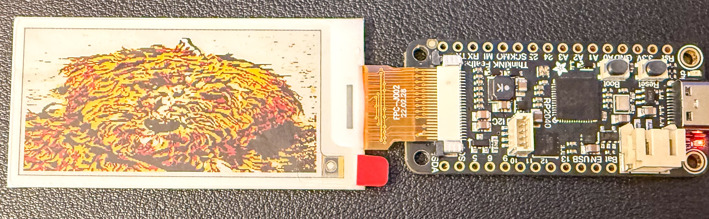

# adafruit-feather-thinkink-discovery

This project explores the **Adafruit RP2040 Feather ThinkInk** board using Rust. It provides a set of working examples adapted specifically for this hardware's integrated e-Ink display and onboard sensors/LEDs.

## Project Creation

The project was initialized using the `rp2040-project-template`:

```bash
cargo generate --git https://github.com/rp-rs/rp2040-project-template
🤷   Project Name: adafruit-feather-thinkink-discovery
🔧   Destination: ~/src/adafruit-feather-thinkink-discovery ...
🔧   project-name: adafruit-feather-thinkink-discovery ...
🔧   Generating template ...
✔ 🤷   Which flashing method do you intend to use? · picotool
[ 1/17]   Done: .cargo/config.toml
...
✨   Done! New project created ~/src/adafruit-feather-thinkink-discovery
```

## Hardware Supported

- **Board**: [Adafruit RP2040 Feather ThinkInk](https://www.adafruit.com/product/5727)
- **Displays**: Both displays connect via the onboard modular 24-pin FPC connector:
  - 1.54" Tri-Color (Red/Black/White) e-Paper display ([GDEM0154Z90](https://www.good-display.com/product/436.html)). Controller: **SSD1681**.
  - 2.13" Quad-Color (Red/Yellow/Black/White) e-Paper display ([Product 6373](https://www.adafruit.com/product/6373)). Controller: **JD79661**.
- **NeoPixel**: Onboard WS2812 (Power: GP20, Data: GP21).
- **LED**: Onboard Red LED (GP13).

## Examples

The following examples have been adapted for the ThinkInk hardware:

### 1. Blinky (`examples/blinky.rs`)

Blinks the onboard red LED (GPIO 13).

```bash
cargo run --example blinky
```

### 2. NeoPixel Rainbow (`examples/neopixel_rainbow.rs`)

Cycles through a smooth rainbow on the onboard NeoPixel.

```bash
cargo run --example neopixel_rainbow
```

### 3. SSD1681 e-Ink Text (`examples/ssd1681.rs`)

Displays text and basic geometric primitives on the integrated e-Ink display.

```bash
cargo run --example ssd1681
```

### 4. SSD1681 Tri-Color Image (`examples/ssd1681_image.rs`)

Displays a high-quality, dithered tri-color image (`mocha200x200.bmp`) on the e-Ink display.

```bash
cargo run --example ssd1681_image
```

### 5. JD79661 Quad-Color Text (`examples/jd79661.rs`)

Displays text and shapes in 4 colors (Black, White, Red, Yellow) on the 2.13" display ([Product 6373](https://www.adafruit.com/product/6373)).

```bash
cargo run --example jd79661
```

### 6. JD79661 Quad-Color Image (`examples/jd79661_image.rs`)

Displays a 4-color dithered image on the 2.13" JD79661 display.

```bash
cargo run --example jd79661_image
```




## Utilities

### Image Conversion Scripts

#### Tri-Color (1.54" SSD1681)

```bash
cd examples
./convert_bmp_tri.sh my_image.jpg output.bmp
```

#### Quad-Color (2.13" JD79661)

```bash
cd examples
./convert_bmp_quad.sh my_image.jpg output.bmp
```

## Development Features

- **panic-probe**: Provides detailed crash reports over RTT.
- **defmt**: High-efficiency logging for embedded systems.
- **picotool**: Seamless deployment using BOOTSEL mode (via USB).
