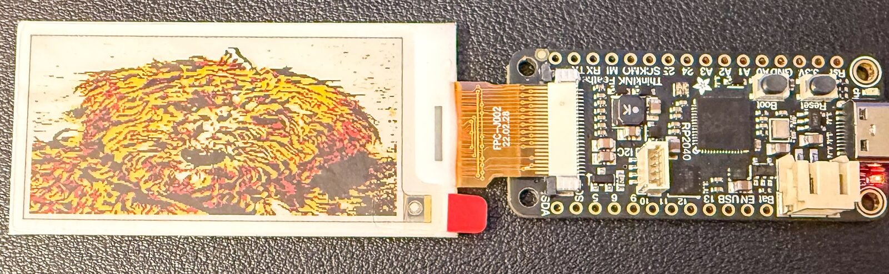
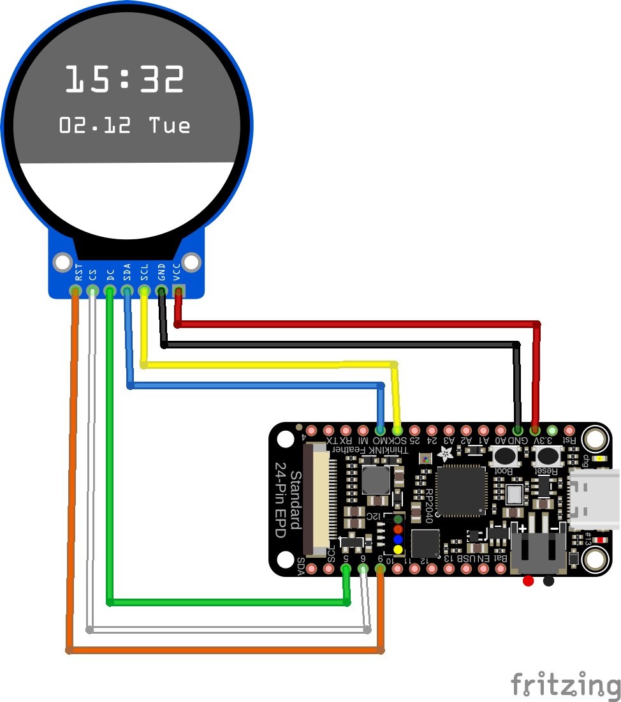

# adafruit-feather-thinkink-discovery

This project explores the **Adafruit RP2040 Feather ThinkInk** board using Rust. It provides a set of working examples adapted specifically for this hardware's integrated e-Ink display and onboard sensors/LEDs.

## Project Creation

The project was initialized using the `rp2040-project-template`:

```bash
cargo generate --git https://github.com/rp-rs/rp2040-project-template
🤷   Project Name: adafruit-feather-thinkink-discovery
🔧   Destination: ~/src/adafruit-feather-thinkink-discovery ...
🔧   project-name: adafruit-feather-thinkink-discovery ...
🔧   Generating template ...
✔ 🤷   Which flashing method do you intend to use? · picotool
[ 1/17]   Done: .cargo/config.toml
...
✨   Done! New project created ~/src/adafruit-feather-thinkink-discovery
```

## Hardware Supported

- **Board**: [Adafruit RP2040 Feather ThinkInk](https://www.adafruit.com/product/5727)
- **Displays**: Both displays connect via the onboard modular 24-pin FPC connector:
  - 1.54" Tri-Color (Red/Black/White) e-Paper display ([GDEM0154Z90](https://www.good-display.com/product/436.html)). Controller: **SSD1681**.
  - 2.13" Quad-Color (Red/Yellow/Black/White) e-Paper display ([Product 6373](https://www.adafruit.com/product/6373)). Controller: **JD79661**.
- **NeoPixel**: Onboard WS2812 (Power: GP20, Data: GP21).
- **LED**: Onboard Red LED (GP13).

## Examples

The following examples have been adapted for the ThinkInk hardware:

### 1. Blinky (`examples/blinky.rs`)

Blinks the onboard red LED (GPIO 13).

```bash
cargo run --example blinky
```

### 2. NeoPixel Rainbow (`examples/neopixel_rainbow.rs`)

Cycles through a smooth rainbow on the onboard NeoPixel.

```bash
cargo run --example neopixel_rainbow
```

### 3. SSD1681 e-Ink Text (`examples/ssd1681.rs`)

Displays text and basic geometric primitives on the integrated e-Ink display.

```bash
cargo run --example ssd1681
```

### 4. SSD1681 Tri-Color Image (`examples/ssd1681_image.rs`)

Displays a high-quality, dithered tri-color image (`mocha200x200.bmp`) on the e-Ink display.

```bash
cargo run --example ssd1681_image
```

### 5. JD79661 Quad-Color Text (`examples/jd79661.rs`)

Displays text and shapes in 4 colors (Black, White, Red, Yellow) on the 2.13" display ([Product 6373](https://www.adafruit.com/product/6373)).

```bash
cargo run --example jd79661
```

### 6. JD79661 Quad-Color Image (`examples/jd79661_image.rs`)

Displays a 4-color dithered image on the 2.13" JD79661 display.

```bash
cargo run --example jd79661_image
```



### 7. BME280 Sensor (`examples/bme280_i2c.rs`)

Reads temperature, humidity, and pressure from a BME280 sensor via the STEMMA QT (I2C1) port.

```bash
cargo run --example bme280_i2c
```

### 8. SSD1306 OLED Image (`examples/ssd1306.rs`)

Displays a 1-bit black and white image on an SSD1306 OLED via STEMMA QT.

```bash
cargo run --example ssd1306
```

### 9. SSD1306 OLED Text (`examples/ssd1306_text.rs`)

Displays text and graphic primitives on an SSD1306 OLED via STEMMA QT.

```bash
cargo run --example ssd1306_text
```

### 10. Combined BME280 + SSD1306 (`examples/bme280_ssd1306.rs`)

Reads data from the BME280 and displays live measurements on the SSD1306 OLED. Useful for seeing data without a hardware debugger.

```bash
cargo run --example bme280_ssd1306
```

### 11. SH1107 OLED Image (`examples/sh1107_i2c.rs`)

Displays a 1-bit black and white image on the Adafruit FeatherWing OLED - 128x64 OLED (SH1107).

**Hardware:**

- [Adafruit FeatherWing OLED - 128x64 OLED](https://www.adafruit.com/product/4650)

**Wiring:**

- Stack the FeatherWing on top of the Feather board using the header pins.

```bash
cargo run --example sh1107_i2c
```

### 12. USB Serial Defmt (`examples/usb_serial_defmt.rs`)

Demonstrates `defmt` logging over the board's native USB Serial port. This is ideal for high-performance logging without a hardware debugger.

**How to run:**

1. Put the board in BOOTSEL mode (hold BOOT, press RESET).
2. Run the example:

    ```bash
    cargo run --example usb_serial_defmt
    ```

3. In a **separate terminal**, decode the logs:

    ```bash
    cat /dev/cu.usbmodem* | defmt-print -e target/thumbv6m-none-eabi/debug/examples/usb_serial_defmt
    ```

### 13. USB Serial Log (`examples/usb_serial_log.rs`)

Simple text logging over USB Serial that works with `screen` or `minicom` (no decoder required).

```bash
cargo run --example usb_serial_log
```

### 14. GC9A01 SPI Image (`examples/gc9a01_spi.rs`)

Displays images (Ferris and Rust logo) on a 240x240 round LCD (GC9A01) via SPI1.

**Wiring:**

- **SCK**: GPIO 14
- **MOSI**: GPIO 15
- **CS**: GPIO 6
- **DC**: GPIO 5
- **RST**: GPIO 9

```bash
cargo run --example gc9a01_spi
```



### 15. GC9A01 SPI Text (`examples/gc9a01_spi_text.rs`)

Displays text and geometric shapes on a 240x240 round LCD.

```bash
cargo run --example gc9a01_spi_text
```

### 16. SSD1680 2.13" Monochrome (`examples/ssd1680_gdem0213b74_epd.rs`)

`GDEM0213B74` (122x250, Adafruit 6383) driven through the [`epdsi`](https://crates.io/crates/epdsi)
framework. Full refresh, then six genuinely differential partial updates with the logos swapping
each pass, then a full-waveform cleanup. Port of the Raspberry Pi Pico 2 example, with everything
above `main` unchanged.

```bash
cargo run --release --example ssd1680_gdem0213b74_epd
```

### 17. SSD1680 2.66" Tri-Color (`examples/ssd1680_gdey0266z90_epd.rs`)

`GDEY0266Z90` (152x296 Black/White/Red, sold by Waveshare as the 2.66" e-Paper Module (B)).
Exercises all four SSD1680 refresh modes — `Full`, windowed `Full`, `FastFull` and
`BaseMap`/`Partial` — and times each, so the cost of every mode on colour glass is measurable
rather than assumed. Takes about two minutes.

The Arduino sketches this panel was first brought up with were written for **this** board, so it is
the one place GxEPD2 and `epdsi` can be compared on identical hardware.

```bash
cargo run --release --example ssd1680_gdey0266z90_epd
```

### 18. SSD1680 Partial-Refresh Bisect (`examples/epd_diag_partial.rs`)

Diagnostic rather than demo, for the 2.13" panel. Times three cases — full frame on `Full`, full
frame on `Partial`, and a banded window on `Partial` — so a partial-refresh fault can be narrowed
to the fast LUT or the windowed write. The same test exists in `rust-rpico2-discovery` and
`xiao-esp32c3-blinky`, so figures are directly comparable across hosts; that cross-host comparison
is what identified a failing XIAO ESP32-C3.

```bash
cargo run --release --example epd_diag_partial
```

> Examples 16-18 report over USB serial and print nothing until the panel work finishes — see
> [Logging without a probe](#logging-without-a-probe).

## Flashing and logging

Three routes, in `.cargo/config.toml`. Only the first needs no extra hardware and no working
`picotool`, which is why it is the current default.

### 1. `elf2uf2-rs` — mass storage (default)

```toml
runner = "elf2uf2-rs -d"
```

```bash
# hold BOOT, press RESET, release BOOT — the RPI-RP2 volume appears
cargo run --example blinky
```

This converts the ELF to UF2 and copies it to the mounted `RPI-RP2` volume. That volume *is* the
RP2040 ROM bootloader's mass-storage interface, so this works whenever the board enumerates in
BOOT mode at all, with no debug hardware. The equivalent by hand, useful when `cargo run` is
unavailable:

```bash
elf2uf2-rs target/thumbv6m-none-eabi/debug/examples/<name> /tmp/fw.uf2
cp /tmp/fw.uf2 /Volumes/RPI-RP2/
```

`cp` will report `could not copy extended attributes` — that is macOS complaining about a FAT
volume, and it is harmless: the data blocks land first, the bootloader flashes them and reboots,
which is why the volume disappears mid-copy.

### 2. `picotool` — PICOBOOT

```toml
runner = "picotool load --update --verify --execute -t elf"
```

Uses a *different* bootloader interface from route 1 — vendor-specific USB over libusb rather than
mass storage. **Known broken here:** picotool v2.3.0 on Apple Silicon segfaults (exit 139) on any
command touching USB, `picotool info` included. Its file-only paths such as `uf2 convert` still
work, so the fault is in its USB layer rather than the binary as a whole. Check with:

```bash
picotool info; echo "exit=$?"   # 139 means the segfault is still there
```

Note that `picotool info | head` masks this — you get `head`'s exit code, not picotool's.

### 3. `probe-rs` — SWD

```toml
runner = "probe-rs run --chip RP2040 --protocol swd"
```

The nicest option: flashing plus live RTT logging plus stack unwind on panic. **No SWD connector
is fitted on this board** — SWCLK/SWDIO are pads on the back, plus an unpopulated 2×5 0.05"
header footprint, so it needs soldering. A Raspberry Pi Debug Probe's "D" port carries
SWCLK / GND / SWDIO; the probe does not power the target, so both stay on their own USB.

### Logging without a probe

`defmt` output normally goes over RTT, which needs route 3. Without a probe, use `defmt-bbq` over
USB CDC instead — see `usb_serial_defmt.rs` and the three e-paper examples.

USB CDC needs `usb_dev.poll()` every few milliseconds, and an e-paper refresh blocks for seconds
at a time. So the e-paper examples **run the panel silently and only bring USB up at the end**.
That means the serial device does not exist while the panel is working:

| Example | Panel work before USB appears |
| :--- | ---: |
| `epd_diag_partial` | ~15 s |
| `ssd1680_gdem0213b74_epd` | ~20 s |
| `ssd1680_gdey0266z90_epd` | ~2 min |

> **`zsh: no matches found: /dev/cu.usbmodem*` means the device has not enumerated yet**, not that
> anything failed. The catch is that **`cargo run` returns as soon as flashing completes** — your
> prompt comes back and it looks finished, but the board is only just starting its panel work with
> USB down. Pasting the `cat` command straight after is guaranteed to be too early.

So wait for it rather than guessing. Only the ELF path changes between examples:

```bash
for _ in $(seq 180); do ls /dev/cu.usbmodemEPD* >/dev/null 2>&1 && break; sleep 1; done
cat /dev/cu.usbmodemEPD* | defmt-print -e target/thumbv6m-none-eabi/release/examples/<name>
```

`cat` does not exit on its own — Ctrl-C once the output has printed. The frames are binary, so
`screen` shows garbage; `defmt-print` is required, and it must be given the **matching** ELF —
a mismatch produces garbled or missing lines rather than an error. Every example here is run
with `--release`, so the ELF path only ever differs in its final component.

### Identifying which firmware is on the board

Every example uses the **same USB serial** (`EPD`), so the device node is always
`/dev/cu.usbmodemEPD*` and the command above never changes — no per-example lookup table, and
nothing to remember as more panels are added.

Identification lives in the USB **product string** instead, which does not affect the device name:

```bash
ioreg -r -c IOUSBHostDevice -l | grep -o '"USB Product Name" = "Feather[^"]*"'
# "USB Product Name" = "Feather RP2040 GDEY0266Z90"
```

New examples should follow the same pattern: keep `.serial_number("EPD")`, and put the panel or
purpose in `.product("Feather RP2040 <thing>")`. The first decoded log line should name it too, so
the information survives even if you only have the log.

## Utilities

### Image Conversion Scripts

#### Tri-Color (1.54" SSD1681)

```bash
cd examples
./convert_bmp_tri.sh my_image.jpg output.bmp
```

#### Quad-Color (2.13" JD79661)

```bash
cd examples
./convert_bmp_quad.sh my_image.jpg output.bmp
```

## Development Features

- **panic-probe**: Provides detailed crash reports over RTT.
- **defmt**: High-efficiency logging for embedded systems.
- **picotool**: Seamless deployment using BOOTSEL mode (via USB).
